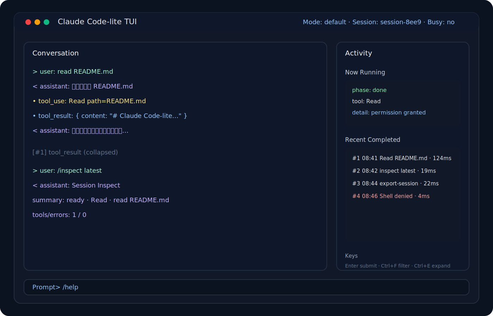

# Claude Code-lite

[中文](./README.md)



A minimal AI coding agent CLI for learning, reverse-engineering ideas, and extension.

It is not a clone of Claude Code, and it is not a full product. It is a local-first, readable, runnable reference implementation that can serve as a starting point for your own agent CLI.

## Background

On April 1st I saw people claiming that the Claude Code CLI source had leaked. At first I assumed it was an April Fools joke. After checking, it turned out to be real, so I downloaded the package and read through it carefully.

My conclusion was straightforward: there was a lot worth learning from, especially around local agent runtime design, tool loops, permission handling, session management, and terminal UI interaction.

Because of legal and ethical constraints, I am not publishing that source code. Instead, I wrote `claude-code-lite` from my own understanding of the ideas. It is not a source dump. It is a small, usable reference implementation with:

- an installable, packageable, runnable CLI
- three entrypoints: TUI, REPL, and headless chat
- real LLM integration behind a provider abstraction
- a usable tool protocol and tool loop
- local file, shell, web, and agent-style tools
- transcripts, session index, resume, export, and cleanup
- minimal permission confirmation and session-scoped permission memory
- a Bun-compiled standalone executable

The goal is to provide a small but structurally clear AI coding agent CLI that people can study, discuss, and extend.

## Project Goals

- Provide a local-first AI coding agent CLI reference implementation
- Break runtime design into understandable layers
- Make tool loops, permissions, sessions, and terminal UI understandable in a small codebase

## Current Capabilities

- installable, packageable, runnable
- TUI, REPL, and headless chat
- real LLM provider integration and tool loop
- transcripts, session index, permission confirmation, session resume, export, and cleanup
- standalone executable output via Bun compile

## Who This Is For

- developers studying AI coding agent CLI runtimes
- developers building their own local coding assistant or agent
- people who want something more complete than a toy demo, but much smaller than a product codebase

## Current Scope

This project is intentionally kept at “minimally useful” complexity. It is a reference implementation, not a full product.

Included:

- basic session/turn runtime boundaries
- Tool protocol
- permission allow/deny/ask model
- transcript storage
- subagent context clone interface
- minimal skills frontmatter interface
- installable CLI with local tools
- environment-variable based OpenAI-compatible / Anthropic LLM layer

Not included:

- full MCP
- full compact / background tasks / bridge
- complex plugin / marketplace / remote orchestration

## Quick Start

### Local Development

```bash
cd claude-code-lite
npm install
bun run build
node ./bin/claude-code-lite.js --help
```

### Global Install

```bash
npm install -g .
claude-code-lite --help
```

### Standalone Executable

```bash
bun run build:exe
./dist/claude-code-lite --help
```

Notes:

- this output does not depend on Node.js
- it embeds the Bun runtime
- the binary is platform-specific and should be built per target platform

## Quick Examples

```bash
# Start TUI
claude-code-lite

# Start persistent REPL
claude-code-lite repl

# Run a direct chat turn
claude-code-lite chat "read README.md"

# Inspect sessions
claude-code-lite sessions --limit 10

# Inspect the latest session
claude-code-lite inspect latest

# Export a session
claude-code-lite export-session latest --format markdown --output /tmp/session.md

# Build standalone executable
bun run build:exe
```

## Repository Layout

```text
claude-code-lite/
  app/
  runtime/
  tools/
  permissions/
  skills/
  storage/
  shared/
```

Recommended starting points:

1. `tools/Tool.ts`
2. `runtime/query.ts`
3. `permissions/engine.ts`
4. `tools/agent/subagentContext.ts`
5. `storage/transcript.ts`

## Documentation

Read in this order:

1. [docs/architecture.en.md](./docs/architecture.en.md)
2. [docs/runtime-flow.en.md](./docs/runtime-flow.en.md)
3. [docs/core-interfaces.en.md](./docs/core-interfaces.en.md)
4. [docs/next-steps.en.md](./docs/next-steps.en.md)
5. [docs/github-release-kit.en.md](./docs/github-release-kit.en.md)

Chinese docs are also available:

- [docs/architecture.md](./docs/architecture.md)
- [docs/runtime-flow.md](./docs/runtime-flow.md)
- [docs/core-interfaces.md](./docs/core-interfaces.md)
- [docs/next-steps.md](./docs/next-steps.md)

## Packaging and Distribution

### npm package

```bash
npm pack
```

Then install the generated tarball:

```bash
npm install -g claude-code-lite-0.1.0.tgz
claude-code-lite tools
```

### Standalone executable

```bash
bun run build:exe
./dist/claude-code-lite --help
```

## Repository Files

This repository already includes basic GitHub-facing files:

- [CONTRIBUTING.en.md](./CONTRIBUTING.en.md)
- [SECURITY.en.md](./SECURITY.en.md)
- [CHANGELOG.en.md](./CHANGELOG.en.md)
- [.github/ISSUE_TEMPLATE/bug_report.md](./.github/ISSUE_TEMPLATE/bug_report.md)
- [.github/ISSUE_TEMPLATE/feature_request.md](./.github/ISSUE_TEMPLATE/feature_request.md)
- [.github/ISSUE_TEMPLATE/provider_integration.md](./.github/ISSUE_TEMPLATE/provider_integration.md)
- [.github/ISSUE_TEMPLATE/tool_integration.md](./.github/ISSUE_TEMPLATE/tool_integration.md)
- [.github/PULL_REQUEST_TEMPLATE.md](./.github/PULL_REQUEST_TEMPLATE.md)

## Available Commands

Source form:

```bash
bun claude-code-lite/app/main.ts read README.md
bun claude-code-lite/app/main.ts write tmp.txt "hello world"
bun claude-code-lite/app/main.ts edit tmp.txt "hello" "hi"
bun claude-code-lite/app/main.ts shell "pwd"
bun claude-code-lite/app/main.ts fetch https://example.com
bun claude-code-lite/app/main.ts agent "review" "inspect this change" reviewer
bun claude-code-lite/app/main.ts repl
```

Installed form:

```bash
claude-code-lite
claude-code-lite tui
claude-code-lite tools
claude-code-lite sessions
claude-code-lite sessions --status needs_attention
claude-code-lite sessions --limit 10
claude-code-lite inspect <session-id>
claude-code-lite export-session <session-id> --format markdown --output /tmp/session.md
claude-code-lite transcript <session-id>
claude-code-lite rm-session <session-id>
claude-code-lite cleanup-sessions --keep 20
claude-code-lite cleanup-sessions --status needs_attention --dry-run
claude-code-lite chat --resume-failed "Continue the failed task"
claude-code-lite chat "read README.md"
claude-code-lite chat --resume latest "Continue the previous task"
claude-code-lite read README.md
claude-code-lite shell "pwd"
```

Auto-approve mutating tools:

```bash
claude-code-lite --yes write tmp.txt "hello world"
```

Headless chat with streaming:

```bash
claude-code-lite --stream chat "Read README and summarize it"
claude-code-lite --no-stream chat "Read README and summarize it"
claude-code-lite --stream chat --resume latest "Continue based on the previous result"
claude-code-lite --stream chat --resume-failed "Continue the failed task"
```

## Session Storage

Transcripts are written to:

```text
.claude-code-lite/transcripts/<session-id>.jsonl
```

Session metadata is written to:

```text
.claude-code-lite/sessions/<session-id>.json
```

Metadata includes:

- `createdAt / updatedAt`
- `title`
- `messageCount`
- `firstPrompt / lastPrompt`
- `provider / model`

`sessions` and `transcript` output readable terminal-oriented views rather than raw JSON.

Extra session fields:

- `status`
- `toolUseCount / errorCount`
- `lastTool`
- `lastError`

Filtering:

```bash
claude-code-lite sessions --status needs_attention
claude-code-lite sessions --limit 10
```

`needs_attention` sessions are sorted first by default.

Compact transcript view:

```bash
claude-code-lite transcript <session-id> --compact
```

Session management:

```bash
claude-code-lite inspect <session-id>
claude-code-lite export-session <session-id> --format markdown --output /tmp/session.md
claude-code-lite rm-session <session-id>
claude-code-lite cleanup-sessions --keep 20
claude-code-lite cleanup-sessions --older-than 30
claude-code-lite cleanup-sessions --status needs_attention --dry-run
```

## LLM Configuration

Minimal setup:

```bash
export CCL_LLM_PROVIDER=openai
export CCL_LLM_API_KEY=your_api_key
export CCL_LLM_MODEL=gpt-4o-mini
```

Optional:

```bash
export CCL_LLM_BASE_URL=https://api.openai.com/v1
export CCL_LLM_SYSTEM_PROMPT="You are a precise coding assistant."
export CCL_ANTHROPIC_VERSION=2023-06-01
```

Notes:

- `openai` uses OpenAI-compatible `chat/completions`
- `anthropic` uses Anthropic `messages`
- provider logic is abstracted and not hard-coded to one vendor
- if no LLM is configured, the runtime falls back to the local planner
- if the configured provider fails, the runtime also falls back to the local planner
- OpenAI supports streaming text output
- Anthropic also supports SSE streaming
- headless chat supports `--stream` / `--no-stream`

## TUI

Running `claude-code-lite` starts the full-screen TUI.

It supports:

- natural-language prompts for local actions
- slash commands such as `/help`, `/sessions`, `/inspect`, `/export-session`
- conversation/activity split layout
- foldable tool results
- permission modal overlays
- timeline filtering
- `/resume latest` and `/resume failed`

## REPL

`claude-code-lite repl` starts a persistent session REPL.

It supports:

- multi-turn shared session
- streamed assistant output
- tool step logs
- `Ctrl+C` turn interruption
- session inspection/export/cleanup
- resume latest / failed / explicit session
