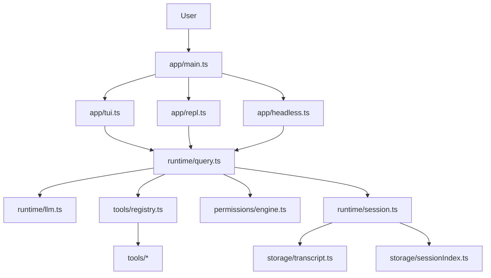

# Claude Code-lite Architecture

[中文](./architecture.md)

This document describes the current implemented architecture of `claude-code-lite`, not an idealized design.

## Layers

The current codebase can be understood in six layers:

1. entrypoints
2. interaction shells
3. query runtime
4. tool / permission layer
5. session / transcript layer
6. LLM provider layer

## Module Responsibilities

### `app/main.ts`

- parse CLI mode and global flags
- route to TUI, REPL, or headless command mode

### `app/tui.ts`

- full-screen terminal UI
- conversation/activity rendering
- permission modal
- slash commands

### `app/repl.ts`

- persistent line-based session
- streamed assistant output
- tool step logs

### `app/headless.ts`

- utility commands
- one-shot chat command
- export / inspect / cleanup / sessions

### `runtime/query.ts`

- single-turn execution loop
- choose LLM or fallback planner
- normalize assistant text and tool calls
- run permission checks
- execute tools

### `tools/Tool.ts`

- stable tool extension boundary
- execution, description, read-only, concurrency, validation, permission hooks

### `permissions/engine.ts`

- `allow / deny / ask`
- session-scoped permission memory

### `runtime/session.ts`

- hold in-memory messages
- append transcript
- update session index

### `runtime/llm.ts`

- provider abstraction
- OpenAI-compatible / Anthropic request shaping
- SSE parsing
- normalize to one turn response shape

## Why This Structure Works

- interaction concerns stay out of runtime
- provider-specific logic stays out of TUI / REPL
- tools are defined through one protocol
- session persistence is separated from runtime orchestration

## Current Limits

- no advanced compact system
- no true tool result budget inside runtime yet
- no full MCP runtime
- no full subagent runtime

## Recommended Reading Order

1. `app/main.ts`
2. `runtime/query.ts`
3. `tools/Tool.ts`
4. `permissions/engine.ts`
5. `runtime/session.ts`
6. `runtime/llm.ts`
