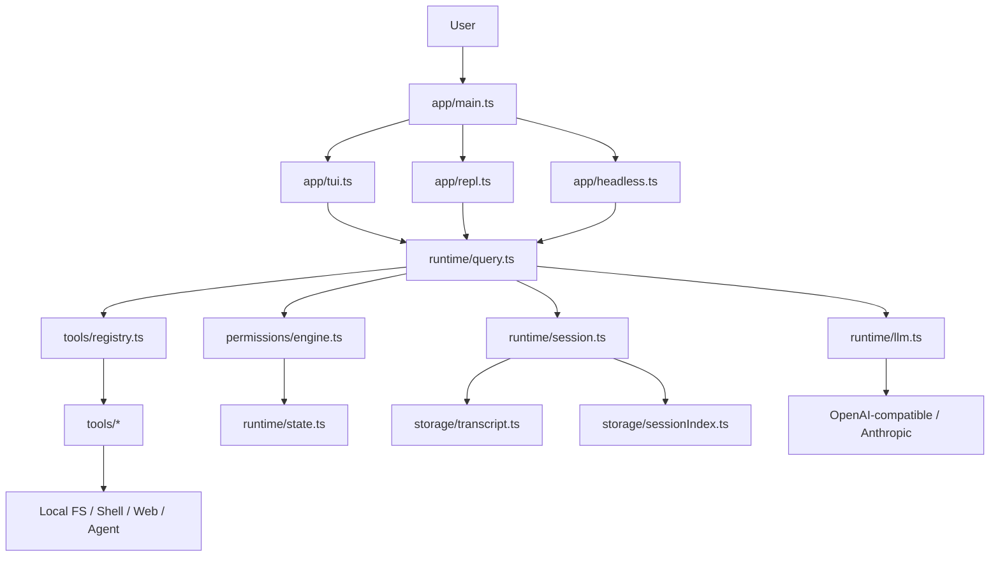
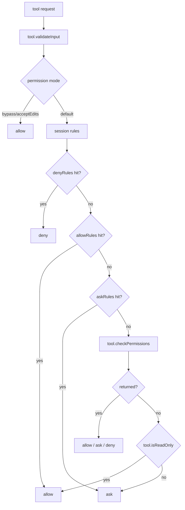
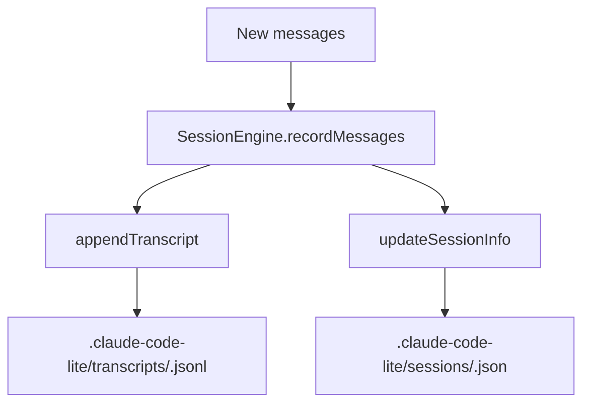

# Claude Code-lite Architecture

[English](./architecture.en.md)

这份文档描述 `claude-code-lite` 当前已经落地的架构，而不是理想化设计稿。

如果你准备基于这个项目继续做 AI 编程 agent，这份文档的目标是帮你先建立稳定心智模型，再去改代码。

## 1. 总体分层

当前实现可以分成 6 层：

1. 入口层
2. 交互层
3. Query Runtime
4. Tool / Permission 层
5. Session / Transcript 层
6. LLM Provider 层

对应目录：

```text
claude-code-lite/
  app/           # TUI / REPL / headless CLI
  runtime/       # query loop / llm / messages / session / state
  tools/         # Tool 协议与工具实现
  permissions/   # allow/deny/ask 与 session 规则
  storage/       # transcript 与 session metadata
  shared/        # ids / fs / cli helpers
```

## 2. 总体架构图



## 3. 模块职责

### 3.1 入口层

入口在 [app/main.ts](../app/main.ts)。

职责很简单：

- 解析 `--yes`
- 解析 `--stream / --no-stream`
- 决定进入 `tui`、`repl`、还是 headless command

这层不做业务决策，只负责 mode routing。

### 3.2 交互层

#### TUI

[app/tui.ts](../app/tui.ts)

职责：

- 全屏终端界面
- 渲染 `Conversation / Activity`
- 显示当前执行状态和权限弹窗
- 接收用户输入并提交给 `query()`
- 处理 slash command

特点：

- 面向“持续交互”
- 更像 Claude Code CLI 的使用方式

#### REPL

[app/repl.ts](../app/repl.ts)

职责：

- 逐行交互
- 持续 session
- 流式打印 assistant 文本和 tool step
- 支持 `/resume`、`/sessions`、`/inspect`

特点：

- 比 TUI 更轻
- 更适合调试 runtime 行为

#### Headless CLI

[app/headless.ts](../app/headless.ts)

职责：

- 执行单次命令
- 兼容脚本化调用
- 提供 `chat`、`sessions`、`inspect`、`export-session` 等 utility command

特点：

- 最适合自动化或 shell 集成

## 4. Query Runtime

核心在 [runtime/query.ts](../runtime/query.ts)。

它是当前系统的主状态机，负责：

- 接收 prompt 和历史 messages
- 构造 tool definition
- 决定使用真实 LLM 还是 fallback planner
- 处理 assistant text
- 处理 tool call
- 执行 permission gate
- 执行 tool
- 产出 `assistant` / `tool_result` message

### 4.1 Query Loop 图

```mermaid
flowchart TD
    P[Prompt + History] --> Q[query()]
    Q --> CFG{LLM configured?}

    CFG -- yes --> LLM[runLlmTurn()]
    CFG -- no --> PLAN[planPrompt()]

    PLAN --> FALLBACK[synthetic assistant/tool plan]
    LLM --> RESP[text + toolCalls]

    RESP --> TC{tool calls?}
    FALLBACK --> TC

    TC -- no --> DONE[emit assistant text message]
    TC -- yes --> PERM[canUseTool()]

    PERM --> DEC{allow / ask / deny}
    DEC -- deny --> ERR[emit tool_result error]
    DEC -- ask --> UI[interaction layer asks user]
    UI --> TOOL
    DEC -- allow --> TOOL[tool.call()]

    TOOL --> RESULT[emit tool_result]
    RESULT --> DONE
```

### 4.2 当前 query 的两个模式

#### 模式 1：真实 LLM

当环境变量存在时：

- `CCL_LLM_API_KEY`
- `CCL_LLM_MODEL`

`query()` 会调用 [runtime/llm.ts](../runtime/llm.ts)。

支持：

- OpenAI-compatible
- Anthropic
- 流式文本输出
- tool call 解析

#### 模式 2：本地 fallback planner

当没有 LLM 配置时：

- `read ...`
- `run ...`
- `fetch ...`
- `write ...`
- `edit ...`

这些显式格式会走 `planPrompt()`。

这让项目在没有外部 API 的情况下依然可演示、可学习。

## 5. Tool 协议

核心在 [tools/Tool.ts](../tools/Tool.ts)。

当前 `Tool` 协议不是简单函数，而是一个带运行时语义的对象：

- `name`
- `inputSchema`
- `description()`
- `call()`
- `isReadOnly()`
- `isConcurrencySafe()`
- `validateInput()`
- `checkPermissions()`
- `preparePermissionMatcher()`
- `toClassifierInput()`

## 6. Tool 层架构图

```mermaid
flowchart TD
    Q[query()] --> REG[tools/registry.ts]
    REG --> READ[Read]
    REG --> WRITE[Write]
    REG --> EDIT[Edit]
    REG --> SHELL[Shell]
    REG --> FETCH[WebFetch]
    REG --> AGENT[Agent]

    Q --> FIND[findToolByName()]
    FIND --> TOOLCALL[tool.call()]

    TOOLCALL --> LOCAL[filesystem / shell / web]
    TOOLCALL --> RESULT[ToolResult]
    RESULT --> Q
```

当前这套设计的价值在于：

- 工具能力是统一抽象
- 权限、描述、执行语义都挂在同一个对象上
- 后面扩展 MCP / subagent 时不用重写整个 runtime

## 7. Permission 模型

核心在 [permissions/engine.ts](../permissions/engine.ts)。

当前是最小可用版，但已经具备运行时结构：

- `allow`
- `deny`
- `ask`

还支持 session 内规则记忆：

- `allowRules`
- `denyRules`
- `askRules`

匹配维度目前基于：

- `toolName`
- `path`
- `command`
- `url`
- `description`

## 8. Permission 决策图



## 9. Session / Transcript 层

### 9.1 SessionEngine

核心在 [runtime/session.ts](../runtime/session.ts)。

职责：

- 保存当前 session message history
- 追加 transcript
- 更新 session metadata index
- 提供 `sessionId` 和 transcript path

### 9.2 Transcript

[storage/transcript.ts](../storage/transcript.ts)

负责：

- `.jsonl` 追加写入
- transcript 读取
- transcript 删除

### 9.3 Session Index

[storage/sessionIndex.ts](../storage/sessionIndex.ts)

负责：

- 保存 `.json` metadata
- 回填旧 transcript 的 metadata
- 统计：
  - `messageCount`
  - `toolUseCount`
  - `errorCount`
  - `status`
  - `lastTool`
  - `lastError`
  - `summary`

### 9.4 Session 存储图



## 10. LLM Provider 层

核心在 [runtime/llm.ts](../runtime/llm.ts)。

当前 provider 抽象包含：

- `LlmConfig`
- `LlmToolDefinition`
- `LlmTurnResponse`
- `runLlmTurn()`

已支持：

- OpenAI-compatible chat completions
- Anthropic messages
- SSE streaming
- tool call 解析

当前的抽象强度刚好够学习和扩展，但还不是最终稳定接口。

## 11. 三入口关系图

```mermaid
flowchart LR
    MAIN[app/main.ts]

    MAIN --> TUI[Full-screen TUI]
    MAIN --> REPL[Line REPL]
    MAIN --> HEADLESS[Headless CLI]

    TUI --> QUERY[query()]
    REPL --> QUERY
    HEADLESS --> QUERY

    HEADLESS --> UTIL[sessions / inspect / export / cleanup]
```

## 12. 当前架构的优点

### 12.1 可读性还在

虽然已经有 TUI、REPL、provider、permissions、sessions，但整体复杂度还没有爆炸。对于参考项目，这点非常重要。

### 12.2 本地优先

就算没有远程 LLM，也可以通过 fallback planner 演示 tool loop，这对教学和二次开发很友好。

### 12.3 抽象边界基本成型

现在最关键的四个边界已经清楚：

- interaction shell
- query runtime
- tool protocol
- session storage

## 13. 当前架构的限制

### 13.1 还没有真正的 tool result budget

导出和 inspect 做了裁剪，但 runtime 内部还没有统一预算控制。

### 13.2 错误模型还偏散

目前更多依赖普通 `Error`，后面如果要继续增强恢复和状态展示，这会成为限制。

### 13.3 AgentTool 仍是轻量能力

目前更像“最小代理动作”，不是完整 subagent runtime。

## 14. 如果你要继续扩展，先从哪开始

最建议的顺序：

1. 稳定 `query()` 的错误与结果预算
2. 稳定 `LlmProvider` 抽象
3. 再补最小 MCP
4. 最后再做最小 subagent

原因很直接：

如果 query runtime 本身不稳，后面所有扩展都会叠加复杂度；先稳 runtime，再扩 capability，是最省力的路线。
