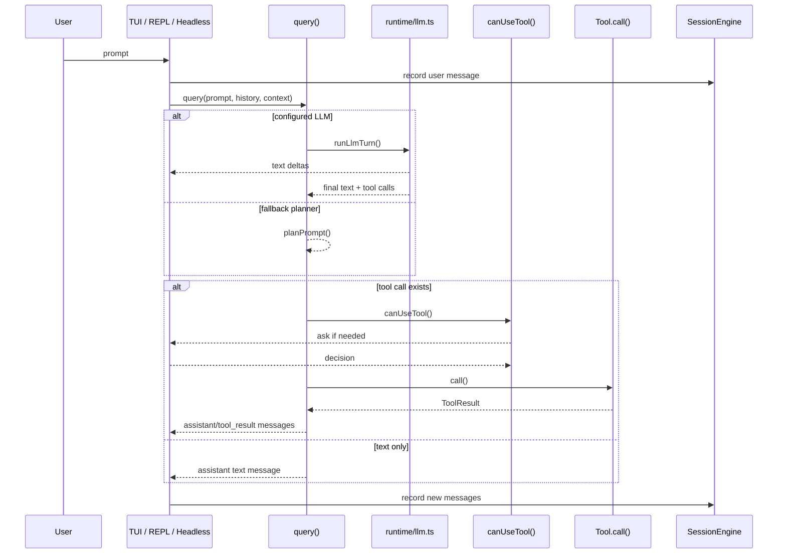
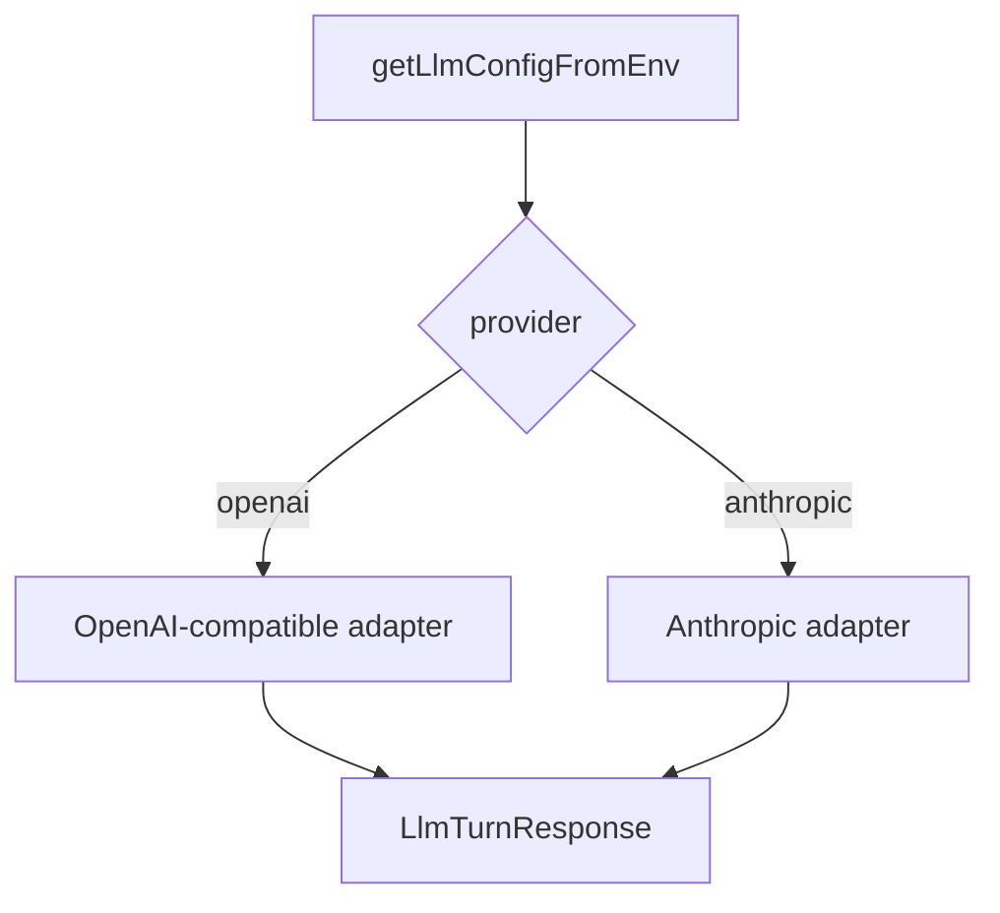
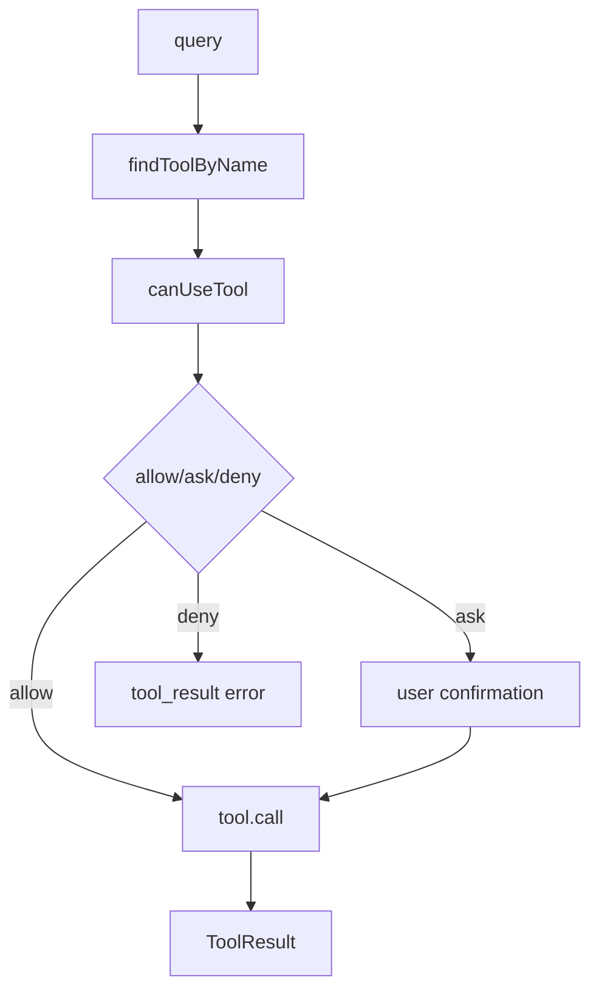

# Claude Code-lite Runtime Flow

[中文](./runtime-flow.md)

This document focuses on runtime behavior:

1. what happens after user input
2. how tool calls run
3. how sessions and transcripts are persisted

## Turn Flow

## Entrypoints

### TUI

- full-screen interaction
- best for day-to-day local usage

### REPL

- lighter persistent session
- good for debugging runtime behavior

### Headless

- best for scripts and utility commands
- also exposes chat, sessions, inspect, export, cleanup

## Query Responsibilities

`runtime/query.ts` currently:

- builds tool definitions
- chooses provider or fallback planner
- processes assistant text and tool calls
- checks permissions
- executes tools
- emits normalized messages

## Provider Flow

Both providers normalize to:

- `text`
- `toolCalls[]`

## Tool Flow

## Session Persistence

`SessionEngine.recordMessages()` currently:

1. appends `.jsonl` transcript
2. updates `.json` session metadata

This split is deliberate:

- transcript stores raw history
- session index stores searchable / display-friendly metadata

## Current Limitations

- no advanced compacting
- no runtime-level result budget yet
- no full MCP layer
- no full subagent runtime
