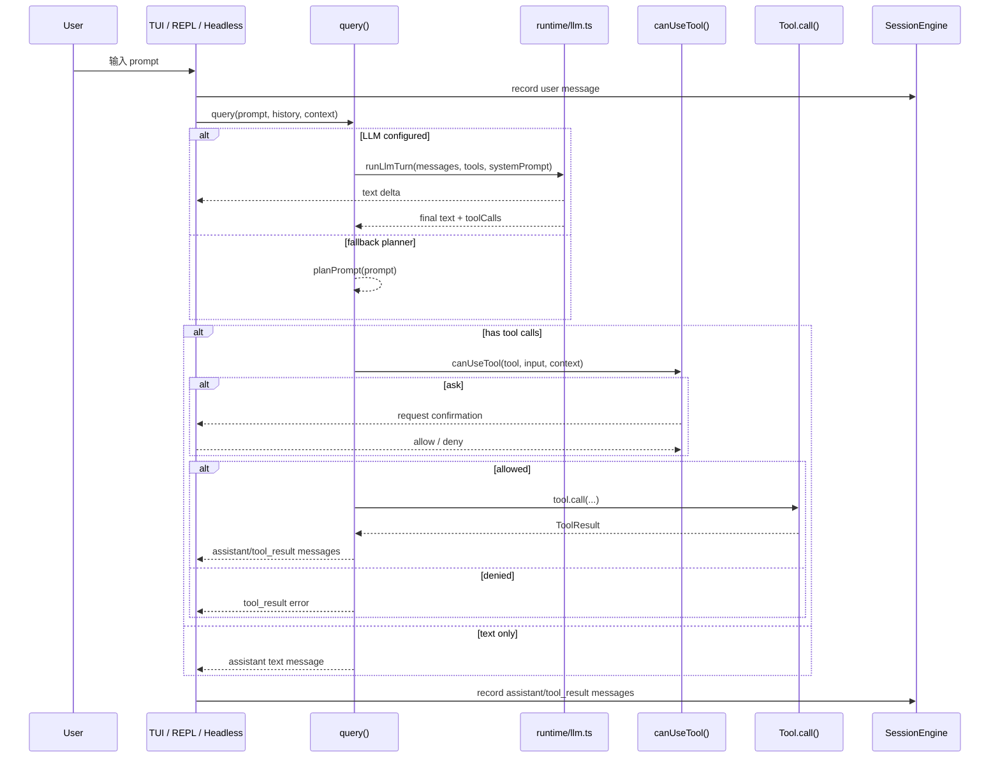
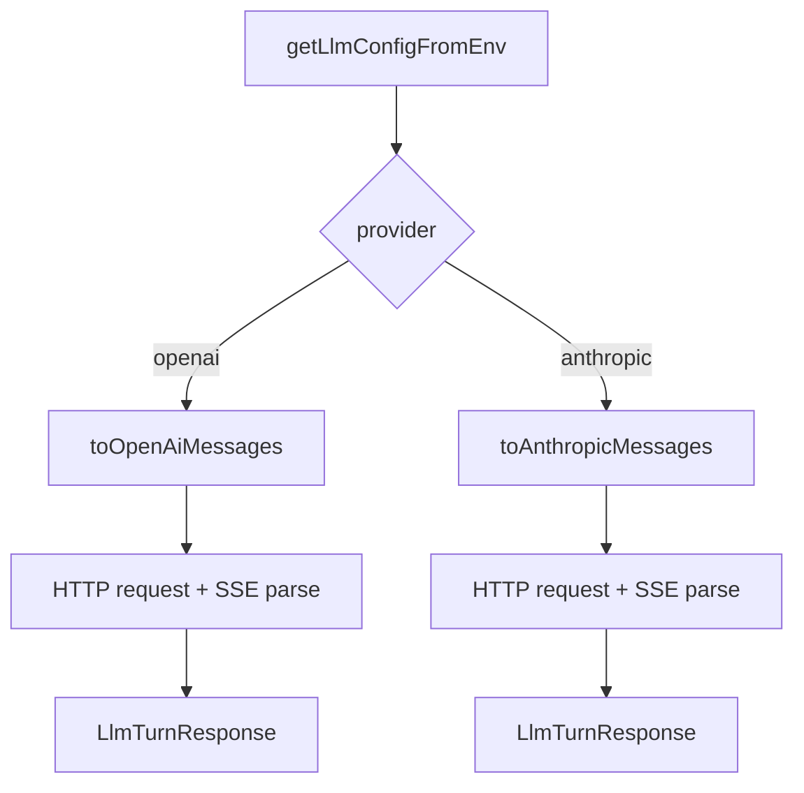
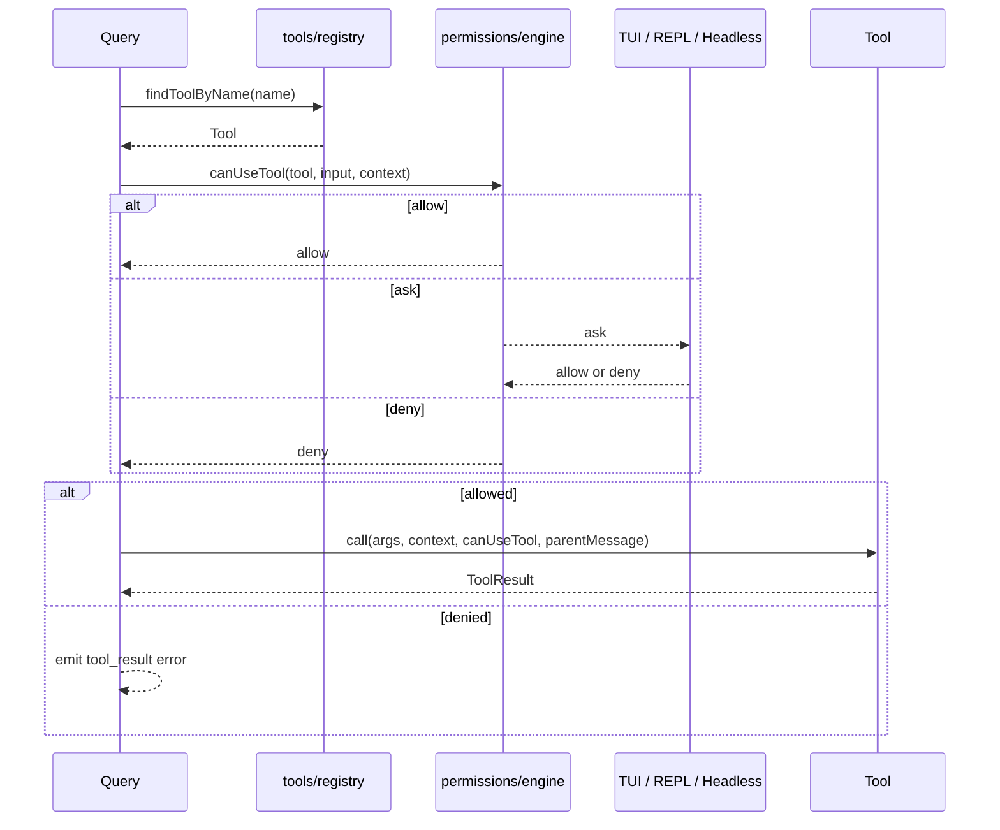
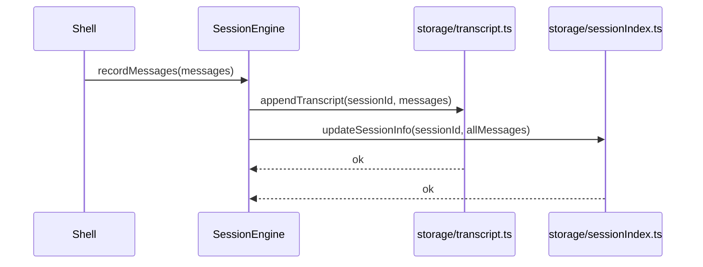

# Claude Code-lite Runtime Flow

[English](./runtime-flow.en.md)

这份文档专门讲运行时流程，不重复介绍目录结构。

重点回答三个问题：

1. 用户输入后发生了什么
2. tool call 是怎么跑起来的
3. session/transcript 是怎么落盘的

## 1. 一次完整 turn 的时序图



## 2. 入口差异

三种入口都共享同一个 query runtime，但行为重点不同。

### 2.1 TUI

[app/tui.ts](../app/tui.ts)

特点：

- 默认入口
- 全屏渲染
- 维护 `Conversation` 和 `Activity`
- 权限确认是 modal overlay
- 支持 slash command 和流式 assistant 文本

适合：

- 日常交互
- 演示 agent CLI
- 观察 tool 执行过程

### 2.2 REPL

[app/repl.ts](../app/repl.ts)

特点：

- 单行输入
- 持续 session
- 文本流式输出
- 更容易看到 stdout 风格的结果

适合：

- 调试 query / permission / tool loop
- 不需要全屏 TUI 的场景

### 2.3 Headless

[app/headless.ts](../app/headless.ts)

特点：

- 单次命令入口
- 可以直接跑 utility command
- 适合脚本化和 shell 集成

适合：

- 自动化
- CI / shell alias
- 导出 transcript / session 检查

## 3. Query 的内部流程

核心在 [runtime/query.ts](../runtime/query.ts)。

## 3.1 Query 决策树

```mermaid
flowchart TD
    START[query(params)] --> CFG[getLlmConfigFromEnv()]
    CFG --> HASCFG{config exists?}

    HASCFG -- no --> PLAN[planPrompt()]
    PLAN --> ACTION{text or synthetic tool action}

    HASCFG -- yes --> TOOLS[getToolDefinitions()]
    TOOLS --> TURN[runLlmTurn()]
    TURN --> RESP[LlmTurnResponse]

    RESP --> TEXT[text blocks]
    RESP --> CALLS[tool calls]

    ACTION --> MERGE[normalize into assistant/tool actions]
    TEXT --> MERGE
    CALLS --> MERGE

    MERGE --> EXEC{tool actions exist?}
    EXEC -- no --> OUT[emit assistant text]
    EXEC -- yes --> RUN[run tool pipeline]
```

### 3.2 Fallback planner 的作用

如果没配 LLM，系统不会彻底失能。

`planPrompt()` 目前支持：

- `read ...`
- `run ...`
- `fetch ...`
- `write ...`
- `edit ...`

这层的目的不是智能，而是：

- 让 runtime 可演示
- 让 tool loop 在无 API key 场景下仍可验证
- 方便教学

## 4. LLM Provider Flow

核心在 [runtime/llm.ts](../runtime/llm.ts)。

## 4.1 Provider 流程图



### 4.2 当前 provider 输出统一到了什么层

无论 OpenAI-compatible 还是 Anthropic，最终都归一到：

- `text`
- `toolCalls[]`

这一步很关键，因为 query runtime 不需要理解 provider 细节，只要理解统一的 turn response。

## 5. Tool 执行流

Tool 抽象在 [tools/Tool.ts](../tools/Tool.ts)。

## 5.1 Tool 执行时序



## 5.2 当前 permission 的工作方式

`canUseTool()` 的决策顺序是：

1. `validateInput`
2. permission mode short-circuit
3. session deny rules
4. session allow rules
5. session ask rules
6. tool-specific `checkPermissions`
7. read-only 直接放行
8. 默认 ask

这意味着 permission 不是 UI 补丁，而是 runtime 的一部分。

## 6. Session 落盘流程

核心在 [runtime/session.ts](../runtime/session.ts)、[storage/transcript.ts](../storage/transcript.ts)、[storage/sessionIndex.ts](../storage/sessionIndex.ts)。

## 6.1 落盘时序



### 6.2 为什么拆成 transcript + index

这是一个很实用的结构：

- transcript 保存完整历史
- session index 保存面向查询和展示的 metadata

好处：

- `sessions` 不需要每次全量扫描 transcript
- `inspect` 和 `export-session` 可以同时利用 metadata 和 transcript
- 后面加统计、标签、备注时，不必重写 transcript 格式

## 7. 交互命令和 runtime 的关系

当前有两类命令：

### 7.1 runtime command

这些命令会进入 query/tool loop：

- `chat`
- TUI 输入 prompt
- REPL 输入 prompt

### 7.2 utility command

这些命令主要操作 session/transcript/index：

- `sessions`
- `inspect`
- `transcript`
- `export-session`
- `rm-session`
- `cleanup-sessions`

这样拆的好处是：

- 会话管理和 LLM/tool loop 分离
- 工具脚本可以安全地只用 utility command
- runtime 行为变更时，不容易把 session 管理一起搞坏

## 8. 当前实现里最重要的 5 个接口

如果你准备扩展这个项目，最该先理解这 5 个接口：

### 8.1 `query()`

文件：

- [runtime/query.ts](../runtime/query.ts)

它是整个 turn lifecycle 的入口。

### 8.2 `runLlmTurn()`

文件：

- [runtime/llm.ts](../runtime/llm.ts)

它把 provider 细节压扁成统一 turn response。

### 8.3 `Tool`

文件：

- [tools/Tool.ts](../tools/Tool.ts)

它定义了工具系统的扩展边界。

### 8.4 `canUseTool()`

文件：

- [permissions/engine.ts](../permissions/engine.ts)

它决定 tool 是否能执行。

### 8.5 `SessionEngine`

文件：

- [runtime/session.ts](../runtime/session.ts)

它负责把 conversation state 同步到磁盘。

## 9. 当前 runtime 的限制

这份流程文档也要明确限制，不然读者会误判它已经接近完整产品。

### 9.1 还没有复杂 compact

现在没有 Claude Code 级别的上下文压缩系统。

### 9.2 还没有统一 result budget

虽然 inspect/export 做了裁剪，但 query runtime 里还缺统一 budget 层。

### 9.3 还没有真正的 subagent runtime

目前 `Agent` 更像“最小代理能力”，不是完整多代理调度器。

### 9.4 还没有 MCP runtime

这仍然是一个本地最小参考实现，不是完整扩展生态。

## 10. 推荐阅读顺序

如果你第一次读这个项目，建议按这个顺序：

1. [app/main.ts](../app/main.ts)
2. [app/tui.ts](../app/tui.ts)
3. [runtime/query.ts](../runtime/query.ts)
4. [runtime/llm.ts](../runtime/llm.ts)
5. [tools/Tool.ts](../tools/Tool.ts)
6. [permissions/engine.ts](../permissions/engine.ts)
7. [runtime/session.ts](../runtime/session.ts)
8. [storage/sessionIndex.ts](../storage/sessionIndex.ts)

这个顺序的原因很简单：

- 先理解入口和交互壳
- 再理解 query 主循环
- 再理解 provider、tool、permission
- 最后理解 state 如何落盘
